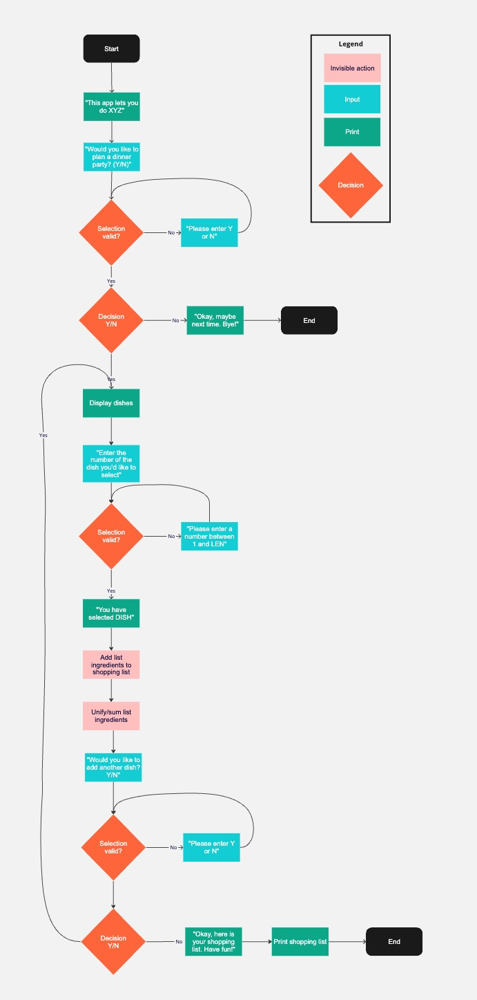
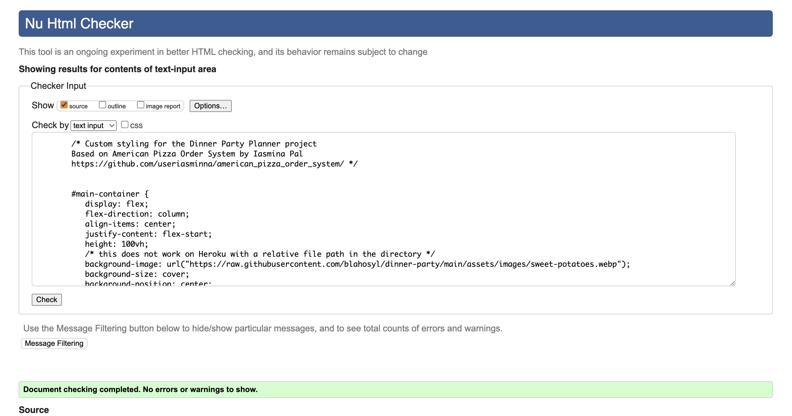
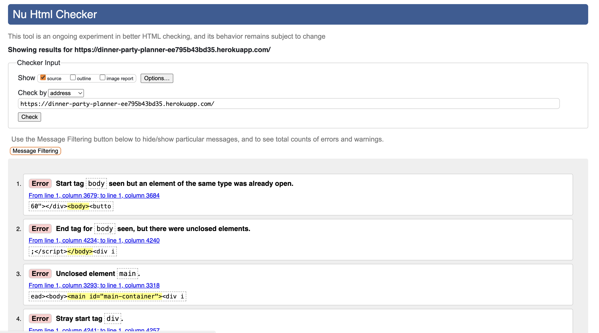
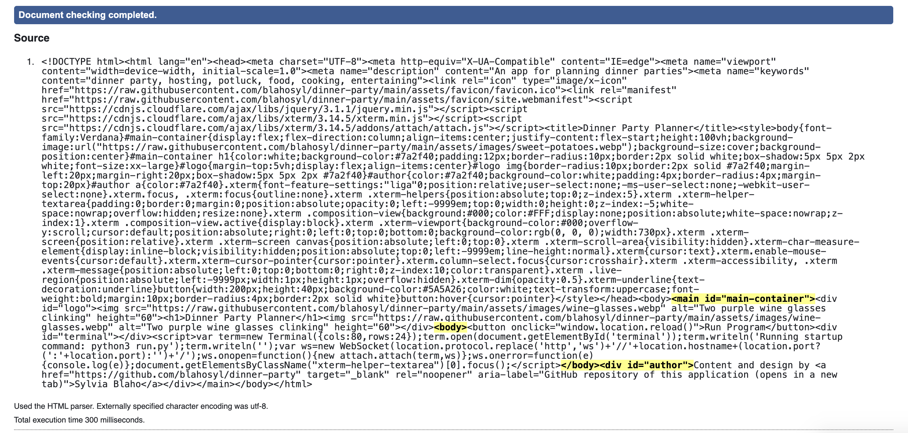
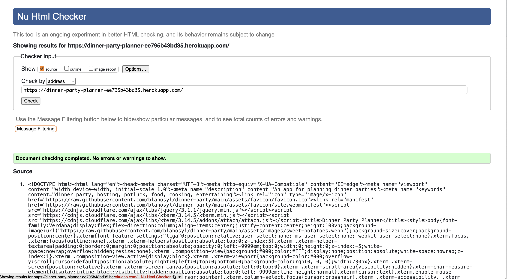

[Go to the deployed app](https://dinner-party-planner-ee795b43bd35.herokuapp.com/)


## Reminders

- Your code must be placed in the `run.py` file
- Your dependencies must be placed in the `requirements.txt` file
- Do not edit any of the other files or your code may not deploy properly

## User Experience (UX)

### User goals

### Creator goals

## Design

### Flow



#### CRUD functionalities

Create

- dataset from Google Sheets
- list of dishes
- shopping list

Read
- dataset from Google Sheets
- list of dishes
- shopping list
- ingredients of a dish

Update
- list of dishes
- shopping list

Delete
- items from the shopping list


### Database

[Google Sheet](https://docs.google.com/spreadsheets/d/1LgNPD9jQ0_7QM3arULAzwTUS3EMnfB1aXBNsTJC_POQ/edit?usp=sharing)

### Visual design of the terminal

#### Pause

#### Clear screen

#### ASCII art

#### Color

The main colors chosen (magenta and green) harmonize with the [background image](#background-image) of the site.

In addition, red is used for validation messages.

However, the use of color in this project goes beyond aesthetic purposes: it also serves to aid the user experience, and is deliberately used to distinguish different functional elements from each other:

|style					|function|
|---					|---|
|colored backgroud 	|user input needed |
|red				 	|user entered invalid data|
|green test			|information that the user needs to proceed|
|magenta ASCII text	|start and end of progam|


### Website design

As this project is focused on the terminal functionalities rather than HTML/CSS, designing/altering these was an optional extra.

Nevertheless, I chose to lightly alter the provided HTML/CSS code to make the deployed page more unique and appealing to users (as a terminal window on a plain white background is alienating to many people).

#### Background image

I chose a [background image](assets/images/sweet-potatoes.webp) of a colorful dish of sweet potatoes, purple onions and thyme being prepared, to illustrate the joy and labor that goes into throwing a dinner party.

#### Button design

I changed the background color of the **Run Program** button to the purple color of the onions from the background image (with the help of [ImageColorPicker](https://imagecolorpicker.com/)). 
This color was chosen to harmonize with the image but still stand out from the rest of the elements on the page.

The color contrast with the white text was checked for accessibility/legibility (see [Color contrasts](#color-contrasts) for more details).


I have also made the button and the text on it larger and increased the font weight. 
To balance out these changes, I also increased the button width and its margin.

Finally, I added a hover cursor effect.

#### Alignment of elements

I horizontally centered all elements on the page and added some top margin for a more pleasing look.

#### Favicon

I added a favicon showing a vector drawing of two wine glasses clinking, to symbolize the social nature of dinner parties. The color of  the graphic is a darker shade of the purple color chosen for the heading box.

#### Meta tags

I added some SEO meta tags to the HTML file, so that the site can be found more easily.

#### Design implementation credits

I followed the [American Pizza Order System project](https://github.com/useriasminna/american_pizza_order_system/) by [
Iasmina Pal](https://github.com/useriasminna) in implementing the changes above.

#### Rerolled design elements

I made some additional changes based on the [American Pizza Order System project](https://github.com/useriasminna/american_pizza_order_system/) that I have decided to reroll: although the modified `layout.html` file passed validation, the deployed page did not. 

<details>
<summary>Click to see the details of the rerolll</summary>

In addition to come styling in the `head` element, the [American Pizza Order System project](https://github.com/useriasminna/american_pizza_order_system/)
added the following code to `@body` in `layout.html`:

```
<body>
    <main id="main-container">
        <h1>AMERICAN PIZZA ORDER SYSTEM</h1>
        @{body}
    </main>
</body>
```

I had adopted this this code, and also added a [logo to the header](#logo) and [my name and a link to the GitHub repository](#author-information-and-github-link).

#### Header

I added the name of the app as an `h1` element before the Run button in the template. For its background, I used the purple color of the onions from the background image (with the help of [ImageColorPicker](https://imagecolorpicker.com/)). 

The heading text color is white, so that it provides sufficient contrast with the background (see [Color contrasts](#color-contrasts) for more details).

##### Logo

I put the [image](assets/images/wine-glasses.webp) used for the favicon as a logo on each side of the header. Its design mirrors that of the box containing the header (box, border radius and shadow), but the colors are inverted.

#### Author information and GitHub link

I added my name and the link to the application's repository under the terminal window, using the colors already defined above.


Validating the resulting `html` file in itself passed without errors.



However, running HTML validation for [the deployed site](https://dinner-party-planner-ee795b43bd35.herokuapp.com/), produced an error of there being multiple `<body>` tags.
I have deduced that the reason for this is that the Code Institute template adds a `<body>` tag as well, resulting in a duplicate.






Accordingly, I have rerolled the changes to `layout.html` that involved adding `html` elements, and kept the styling  to modifications in the `head`.
After this, both the modified `layout.html` file and the [the deployed site](https://dinner-party-planner-ee795b43bd35.herokuapp.com/) passed the W3C validator.




</details>

#### Font

I changed the font used from Arial to Verdana. This font [is considered the most legible](https://www.myfonts.com/pages/fontscom-learning-fyti-using-type-tools-fonts-on-the-web#:~:text=The%20Verdana%C2%AE%20typeface%20is,small%20sizes%20(on%20screen).) of the popular web-safe fonts, especially for small screen sizes.

## Accessibility

### Color contrasts

The [WebAIM](https://webaim.org/resources/contrastchecker/) was used to ensure that the text and background color of the heading provides sufficient contrast for legibility.

The colors used in the project are as follows:

|color name 	|HEX code|
|---			|---	|
|white			|#FFFFFF| 
|onion-purple	|#7A2F40| 
|thyme-green	|#5A5A26| 


The paired colors have the following contrasts:

| color 1 |color 2 |contrast | [WCAG AAA](https://ialabs.ie/what-is-the-difference-between-wcag-a-aa-and-aaa/) |
|---			|---		|:---:		|:---:|
|onion-purple 	|white 	|9.09:1 	| ✅ |
|thyme-green	 	|white 	|7.17:1 	| ✅ |

### Links

The only link (to the GitHub repository) opens in a new window and has an aria-label.

It is visually distinguished from the rest of the text by being underlined.

## Features


"start again" message at the end

functional use of colors/ASCII art

visual separation into screens

as little typing as possible

list of ingredients is

- transformed into a readable string
- alphabetized
- measurements names are shown instead of abbreviations
- singular/plural handled


## Deployment

### Fork the repository

You can fork the repository by following these steps:

1. Log in to [GitHub](https://github.com/) (if you don't have a GitHub account yet, you can [create one](https://docs.github.com/en/get-started/start-your-journey/creating-an-account-on-github) for free).
2. Navigate to the project website [https://github.com/blahosyl/dinner-party](https://github.com/blahosyl/dinner-party).
3. Click on **Fork** in the upper right part of the screen.
4. On the next page you have the possibility to change the repository name. To do this, simply write your desired name in the text field in the center part of the screen. You can also leave the name as it is.
5. Click **Fork** in the bottom right part of the screen.

>[!TIP]
>If you do rename the repository, make sure to keep the [GitHub naming conventions](https://github.com/bcgov/BC-Policy-Framework-For-GitHub/blob/master/BC-Gov-Org-HowTo/Naming-Repos.md) in mind. 

### Deployment to Heroku

1. Create a list of requirements by going to the terminal and typing `pip3 freeze > requirements.txt`. This popuplates your `requirements.txt` file with the list of required files.<br> 
Push your changes to GitHub.
2. Under **Settings > Config Vars** in Heroku, add  a new var  with the key `CREDS` and the value equal to the contents of your `creds.json` file.
3. Under **Settings > Config Vars** in Heroku, add  a new var  with the key  `PORT` witht the key `PORT` and the value `8000`.
4. Under **Settings > Buildpacks** in Heroku, add Python to Heroku Buildpacks.
5. Under **Settings > Buildpacks** in Heroku, add NodeJS to Heroku Buildpacks.
6. Under **Deploy > Deployment method** in Heroku, select **GitHub** and connect Heroku to your GitHub account.<br>
Type in your repository name, then click **Search**. When your repository appears, click **Connect** next to it.
7. Under **Deploy > Manual deploy** in Heroku, select **Deploy branch** to deploy manually.<br>
Once the process is finished, the following message will appear:<br>
_Your app was successfully deployed_<br>
Click **View** under the message, and a new tab will appear with your deployed app.
8. (optional) Under **Deploy > Automatic deploy** in Heroku, select **Enable Automatic Deploys** if your want your app to be rebuild each time you push to the `main` branch of your GitHub repository.

## Technologies used

### Languages

Python

#### External libraries

Which libraries are used and what their purpose is, why they are needed


### Tools used

- [Convert images to `webp` format](https://cloudconvert.com/jpeg-to-webp)
- [Pick colors from an image](https://imagecolorpicker.com/)

## Testing

### User story testing

### Code validation

#### Naming conventions used

- all class names are in `CamelCase`.
- all constant names are in `ALL_CAPS`.
- all variable names are in `snake_case`.
- following my mentor's suggestion, I changed the names of global variables (that are not constants) so that they always start with an underscore: `_global_variable`.


### User input

#### Y/N questions

- `Y` or `N` – correct
- `y` or `n`
- empty string
- space
- special character
- other letter character
- number character

#### Integer from a range

- integer from the specified range – correct
- integer outside the range
- non-integer number
- empty string
- space
- special character
- letter character

Combinations:

- integer outside the range THEN non-number character
- non-number character THEN integer outside the range

### Flow testing

- if the user answers `N` to the 1st question: end with message
- if the user selects a dish:
	- remove it from the list of dishes
	- display its name and ingredients
	- add its ingredients to the shopping list
- if the shopping list already contains an ingredient that is added: combine two items into one, sum the ingredient quantity
- if the user wants to continue adding an ingredient: rerun adding loop
- if the user does not want to  add more ingredients: 
	- display shopping list
	- end adding loop
	- display goodbye message
- if the user selects all dishes: 
	- print shopping list 
	- end program

#### Database data validation (optional)

Check if ingredient cell contains `(`


## Credits

### Study/lookup sources

The following resources were used to learn/double check general, atomic functionalities/syntax:

- [`gspread` user guide](https://docs.gspread.org/en/v6.0.0/user-guide.html)
- [Copy list so it can be changed without affecting the original list](https://stackoverflow.com/a/25004389)
- [Remove item from list](https://www.w3schools.com/python/python_lists_remove.asp)
- [Docstring conventions](https://peps.python.org/pep-0257/)
- [Get combinations of items from a list](https://stackoverflow.com/a/16603347)
- [`itertools` package documentation](https://docs.python.org/3/library/itertools.html#itertools.combinations)
- [Add items to list](https://www.w3schools.com/python/python_lists_add.asp)
- [Remove specified item from a list](https://www.w3schools.com/python/python_lists_remove.asp)
- [Check if a string is empty](https://stackoverflow.com/a/9573259)
- [Convert `input` to `int` with `Try/Except`](https://www.tutorialsteacher.com/articles/convert-input-to-number-in-python)
- [`try`/`except`](https://www.w3schools.com/python/python_try_except.asp)
- [Errors and exceptions](https://docs.python.org/3/tutorial/errors.html)
- [Input validation: integer in range (did not work)](https://stackoverflow.com/questions/11594605/python-excepting-input-only-if-in-range)
- [Insert a substring before/after a certain characted in a string](https://stackoverflow.com/a/30232424/24248624)
- [Delete a character from a string](https://builtin.com/software-engineering-perspectives/python-remove-character-from-string)
- [Fix `TERM environment variable not set` error](https://stackoverflow.com/a/65161315/24248624)
- [Clear the terminal](https://www.geeksforgeeks.org/clear-screen-python/)
- [Naming conventions](https://peps.python.org/pep-0008/)
- [Naming global vs. local variables](https://stackoverflow.com/questions/69193413/why-does-the-python-style-guide-suggest-the-same-style-for-both-global-and-local)
- [Conventions for putting modules into separate files](https://stackoverflow.com/questions/2864366/are-classes-in-python-in-different-files)
- [Classes of the same module can be grouped in the same file](https://softwareengineering.stackexchange.com/a/306492)
- [Print floats in general notation - only print decimal point and decimal place digits if they are "not empty"](https://stackoverflow.com/a/2440708/24248624)
- [String operations](https://docs.python.org/3/library/string.html#format-specification-mini-language)
- [Cut off last character of string](https://stackoverflow.com/a/15478161/24248624)
- [Regular expressions for letters (not used)](https://stackoverflow.com/a/3617808/24248624)
- [`partition` method example ](https://stackoverflow.com/a/54608451/24248624)
- [`partition` method on W3Schools](https://www.w3schools.com/python/ref_string_partition.asp)
- [`colorama` documentation](https://pypi.org/project/colorama/)
- [Escape special characters in ACII art](https://code-institute-room.slack.com/archives/C027C3S3TEU/p1636456674153400?thread_ts=1636388878.151000&cid=C027C3S3TEU
)
- [String literals with `r`](https://stackoverflow.com/a/4780104/24248624)
- [Web-safe fonts](https://www.w3schools.com/cssref/css_websafe_fonts.php)
- [Verdana properties](https://www.myfonts.com/pages/fontscom-learning-fyti-using-type-tools-fonts-on-the-web#:~:text=The%20Verdana%C2%AE%20typeface%20is,small%20sizes%20(on%20screen).)
- [not capitalizing "daiquiri"](https://www.latimes.com/socal/daily-pilot/opinion/tn-hbi-et-1231-casagrande-20151231-story.html)
- [not capitalizin "bloody mary"](https://www.latimes.com/socal/daily-pilot/opinion/story/2020-08-04/a-word-please-lowercase-treatment-in-newswriting-can-humble-important-words#:~:text=But%20since%20the%20drink%20was,drink%20names%20are%20more%20flexible.)


### Code

The following sources contributed code or suggestions to specific functions within the project:

- Rory Patrick Sheridan, my mentor, gave suggestions, helped me solve or spotted bugs described in [these Issues](https://github.com/blahosyl/dinner-party/issues?q=is%3Aissue+label%3Amentor) (see the Issue descriptions and comments for details).
- Modifying the Code Institute template to change some HTML/CSS elements was done on the basis of the [American Pizza Order System project](https://github.com/useriasminna/american_pizza_order_system/) by [
Iasmina Pal](https://github.com/useriasminna).


### Content

All text content was written by me.

### Media

#### Images

[Background image](assets/images/sweet-potatoes.webp) by me, coverted to `webp` with [CloudConvert]((https://cloudconvert.com/jpeg-to-webp)
).

[Image](assets/images/wine-glasses.webp) for the favicon and logo from [Vecteezy](https://www.vecteezy.com/vector-art/2602820-wine-cups-glasses-toasting-line-style-icon), converted to `png` format with Preview, converted to `ico` format with [Favicon.io](https://favicon.io/), coverted to `webp` with [CloudConvert](https://cloudconvert.com/jpeg-to-webp).

### Readme

- [Creating your first README with Kera Cudmore](https://www.youtube.com/watch?v=XbYJ4VlhSnY) by Code Institute
- [Creating your first README](https://github.com/kera-cudmore/readme-examples) by Kera Cudmore
- [Bully Book Club](https://github.com/kera-cudmore/Bully-Book-Club) by Kera Cudmore
- [Bodelschwingher Hof](https://github.com/4n4ru/CI_MS1_BodelschwingherHof/tree/master) by Ana Runje
- [Travel World](https://github.com/PedroCristo/portfolio_project_1/) by Pedro Cristo
- [Sourdough Bakes](https://github.com/siobhanlgorman) by Siobhan Gorman
- [Horizon Photo](https://github.com/Ri-Dearg/horizon-photo/blob/master/README.md#mobile-testing) by Rory Patrick Sheridan
- [The README of my first Code Institute project](https://github.com/blahosyl/academic-publishing)
