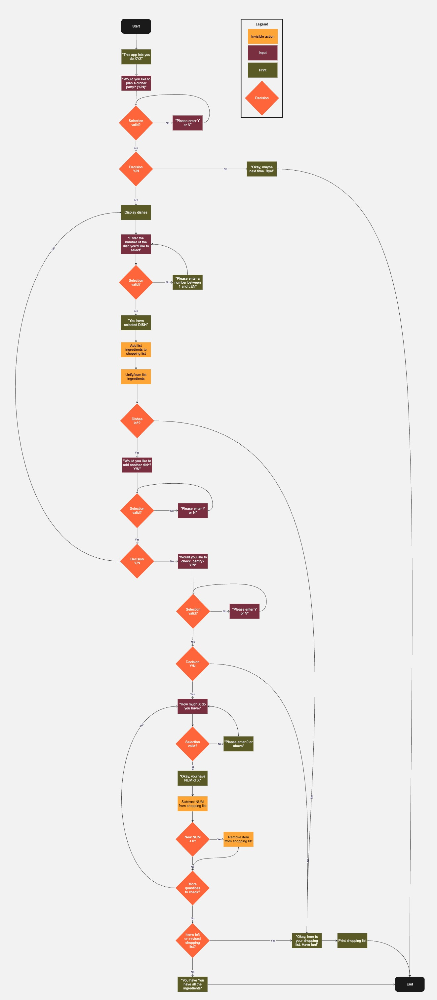
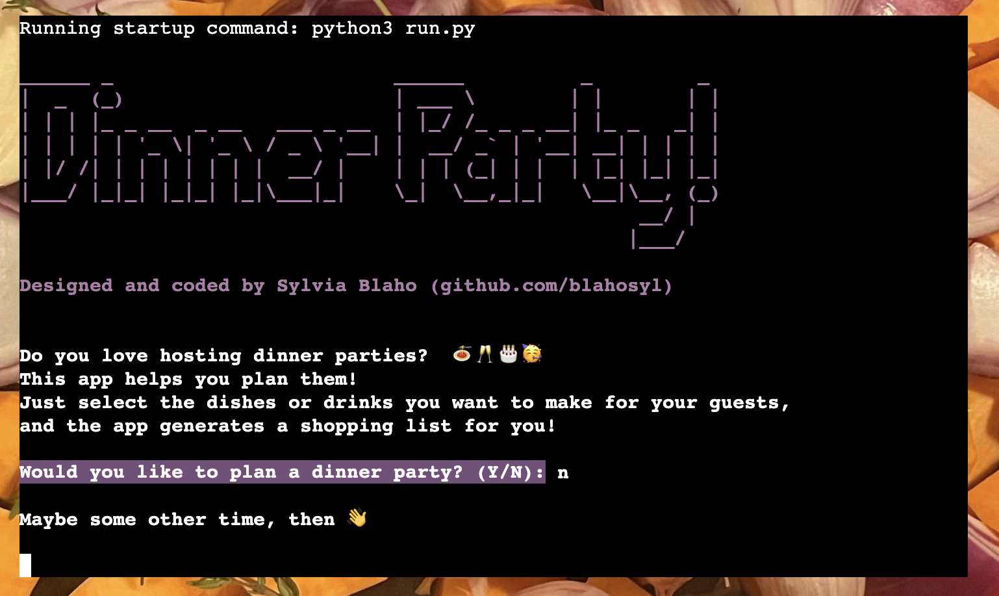
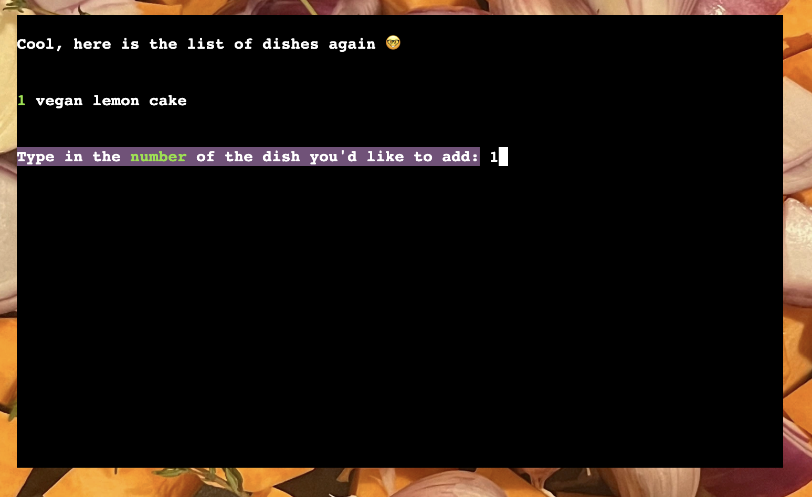
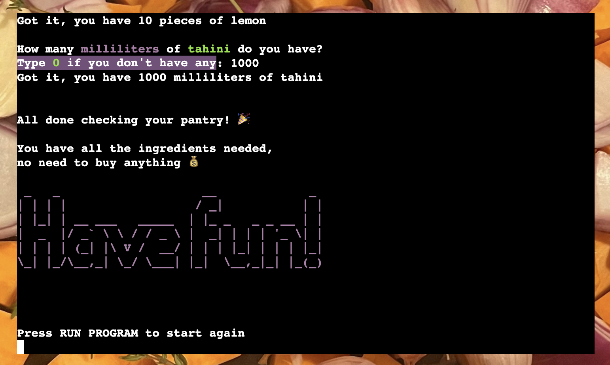

# Dinner Party Planner

This app **creates shopping lists for dinner parties from a recipe database**. 

It provides a **structured flow** with **step-by-step** questions that are straightforward to answer, does all necessary calculations in the background,
and produces a **tailor-made list** depending on the ingredients needed, while also **taking existing stock into account**.

The result is **more user-friendly and less prone to errors** than using Google Sheets' built-in filtering and sorting for the same purpose.

The database contains recipes I routinely use, so this app does not only simulate a real-life process, it actually **is usable in real life**.

It was developed as my first Python project, as a requirement for my coursework for [Code Institute](https://codeinstitute.net/) (Portfolio Project 3).

Developer: [Dr. Sylvia Blaho](https://www.linkedin.com/in/blahosylvia/)


[Go to the deployed app](https://dinner-party-planner-ee795b43bd35.herokuapp.com/)

See the development progress and further plans on [GitHub Projects](https://github.com/users/blahosyl/projects/1/views/2).

<!--Shield.io badges-->


## Table of Contents


## User Experience (UX)

As an avid cook and dinner party host, I maintain several recipe databases in Google Sheets for different occasions, seasons and dietary preferences. These contain a range of dishes, ingredients and substitutions.

As it is not uncommon that I host a series of dinner parties within the same week, it is paramount to be able to pool all the ingredients needed for all these parties together, so that they can be purchased in a single grocery run or delivery.

Google Sheets is very well suited for storing data in a structured way, but it is much less capable of producing a shopping list tailored for a specific occasion. While it is technically possible to create such a list using conditionals, filtering and sorting, it is a cumbersome process prone to manual error.

The Dinner Party Planner app aims to solve this problem. It provides a structured flow with step-by-step questions that are straightforward to answer, does all necessary calculations in the background, and produces a tailor-made list depending on the ingredients needed, while also taking existing stock into account.

### User goals

The same set of goals was determined for all users of the app regardless of whether they are first-time or returning users.

- [UX1] I want to have a user-friendly and easy to use shopping list generator.
- [UX2] I want to see what recipes are available at each stage of planning
- [UX3] I want to choose one or more recipes to shop for
- [UX4] I want to see the ingredients for the dish I selected
- [UX5] I want to get a shopping list of all ingredients correctly added
- [UX6] I want to adjust the shopping list based on the ingredients I already have
- [UX7] I want clear instructions on the next step at each stage of the process
- [UX8] I want to only see relevant information on the screen at each step of the process
- [UX9] I want to be able to visually distinguish different kinds of information on the screen
- [UX10] I want to know the result of each step/choice in the process

### Creator goals

- [CR1] I want to create my first Python application
- [CR2] I want to create an application that fills a real-life need
- [CR3] I want to make use of Object Oriented Programming
- [CR4] I want to reduce code redundancy as much as possible
- [CR5] I want the app to handle all possible user input
- [CR5] I want pre-empt unexpected user input that the application cannot handle
- [CR6] I want the user to always be sure how to interact with the program
- [CR7] I want the app to be as visually appealing as possible under the given constraints of the template
- [CR8] I want to write code with future extensibility and scalability in mind

## Design

### Flow 

#### Scope

From the outset, I had three main goals in mind: ease of use, proper error handling, and scalability.

The diagram below shows the Minimum Viable Product flow for the app. As discussed with my mentor, this satisfies the criteria of an MVP by being usable as is, and also a suitable project to finish in 2 weeks after just starting to learn Python.


The MVP program flow can be summarized as follows:

- if the user answers `Y` to the initial question: start planning loop
- if the user answers `N` to the initial question: end with message
- when the user selects a dish:
	- remove it from the list of dishes
	- display its name and ingredients
	- add its ingredients to the shopping list
- if the shopping list already contains an ingredient that is added: combine two items into one, sum the ingredient quantity
- if the user wants to continue adding an ingredient: rerun planning loop
- if the user does not want to add more ingredients: 
	- end planning loop
	- print shopping list, end program
- if the user selects all dishes: 
	- end planning loop
	- print shopping list, end program


After the MVP was completed well ahead of the expected timeline, and there was more time left until the submission deadline than originally anticipated, I decided to add a new feature that was outside the scope of the MVP: [the `check_pantry()` function](https://github.com/blahosyl/dinner-party/issues/35) and its accompanying logic. 

This loops through each ingredient on the shopping list, asks the user how much of it they already have, and adjusts the quantities accordingly. When the resulting quantity is 0 or less, the item is deleted from the shopping list.

Even though this feature seemed like an easy add-on, it has nearly doubled the steps in the program flow.

The current version of the program flow is as follows ([click here to view the full-size version on Miro](https://miro.com/app/board/uXjVKVLz2oI=/?share_link_id=420958715421)):




The current program flow can be summarized as follows:

- if the user answers `Y` to the initial question: start planning loop
- if the user answers `N` to the initial question: end with message
- when the user selects a dish:
	- remove it from the list of dishes
	- display its name and ingredients
	- add its ingredients to the shopping list
- if the shopping list already contains an ingredient that is added: combine two items into one, sum the ingredient quantity
- if the user wants to continue adding an ingredient: rerun planning loop
- if the user does not want to add more ingredients: 
	- end planning loop
	- ask if they want to check their pantry
- if the user selects all dishes: 
	- end planning loop
	- ask if they want to check their pantry
- if the user does not want to check the pantry:
	- print shopping list, end program
- if the user wants to check the pantry
	- ask how much of each shopping list ingredient they have
	- subtract answer from quantity on shopping list
		- if resulting quantity is 0 or less, remove item from the list
- if there are shopping list items left, print shopping list
- end program with messagemessage

This flow ensures an intuitive progression through the process, and eliminates the need for complicated navigation.

#### Interaction design

##### Minimal typing

The app is designed to work with as little typing as possible. 

Yes/no questions only require a single character as an answer. They accept both capital and lowercase answers.

The list of dishes is presented as a numbered list, so that users only need to enter the dish number, rather than type the whole name of the dish.

The pantry checker function only requires the user to enter a number for each ingredient checked.

##### Information is adjusted for each step

The list of dishes changes dynamically, so only dishes that have not yet been added to the shopping list are shown to the user at each point.

The pantry checker flow only asks inpu for dishes that hau been added to the shopping list.

##### Alphabetization 

All lists shown to the user are alphabetized, which aids visual processing.

##### String transformations

The shopping list is presented twice during the flow of the program: at the end of planning, and during the pantry checking process.

Each of these is very different from each other as well as from how the data is stored, tailored too the specific purpose in the flow.

Both are

- transformed into a readable string
- alphabetized
- measurement names are shown instead of abbreviations
- singular/plural is handled based on the quantity


##### Input in error messages 

When a user enters an invalid input, the input is repeated in the error message. This improves user interaction, and also avoids misunderstanding that could result from a [user entering input before the propmt apppears](https://github.com/blahosyl/dinner-party/issues/39).

##### Tailored error messages

Error messages also show the reason why user input is rejected (not a valid number, out of range, not "Y"or "N"), and remind the user what type of input is accepted for the question on the screen.

### Code design

When revising and refactorig code, I devote special attention to code design, beyond merely getting the functionalities to work. I worked to reduce redundancy and improve readability by utilizing Object Oriented Programming (OOP), reusing functions/methods and splitting up code into separate files where warranted.

#### OOP

The first version of the app consisted of independent functions being called in sequence. While this worked as intended, it lacked organization and scalability, so I decided to recfactor it by creating a module with 2 classes, `DishList` and `ShoppingList`, along with their respective methods and related (but independent) functions.
These can be viewed in [`planner.py`](https://github.com/blahosyl/dinner-party/blob/main/planner.py).

#### Pantry checker

Developing [the pantry checker functionaliy](https://github.com/blahosyl/dinner-party/blob/main/planner.py#L248-L321) inspired a lot of restructuring, refactoring, splitting up functions and rethinking the logic. On the one hand, this significantly expanded the scope of the project compared to the MVP, but it had the added benefit of much cleaner and better code as a result, on top of the actual functionality (which is very relevant to real-life usage).

##### Pantry checker features

- handles floats without upper bound
- measurements names are shown instead of abbreviations
- removes ingredients with quantity less than 0
- handles singular/plural quantities in the output message

#### Y/N validator functions made general-purpose

A relatively easy piece of refactoring involved creating [a general-purpose Y/N question validator function](https://github.com/blahosyl/dinner-party/blob/main/utilities.py#L15-L35). This takes a single parameter, the prompt text to be shown in the `input` block, and only accepts "Y" or "N" (and their lowercase versions) as valid inputs.


#### Range validatior function made general purpose

[The range validator function](https://github.com/blahosyl/dinner-party/blob/main/utilities.py#L38-L97) was much more labour intensive to generalize, as this also involved handling both integers and floats, ranges without an upper bound, and extensive customization of the out put message.

#### File organization

At the suggestion of my mentor and @nobe4, I split up my `run.py` file further, and created 2 dedicated files:
- [`utilities.py`](https://github.com/blahosyl/dinner-party/blob/main/utilities.py) containing general-purpose functions (the input validators and `clear`)
- [`gsheet.py`](https://github.com/blahosyl/dinner-party/blob/main/g.sheetpy) containing all functionalities related to interfacing with Google Sheets


#### CRUD functionalities

##### Create

- dataset from Google Sheets
- list of dishes
- shopping list
- human-readable version of shopping list
- human-readable version of ingredients

##### Read

- dataset from Google Sheets
- list of dishes
- shopping list
- ingredients of a dish

##### Update

- list of dishes
- shopping list quantities
- shopping list items


##### Delete

- items from the shopping list


### Database

The matrix of dishes, ingredients and quantities are stored in this [Google Sheet](https://docs.google.com/spreadsheets/d/1LgNPD9jQ0_7QM3arULAzwTUS3EMnfB1aXBNsTJC_POQ/edit?usp=sharing).

A new test Google account was created for this purpose for security reasons, as I did not consider it good practice to use my real-life credentials for developing my first app of this kind, where the potential for human error is large. 

However, the contents of the database are actually recipes I routinely use, so this app does not only simulate a real-life process, it actually **is** usable in real life.

The database was designed with extensibility in mind, and already contains data structures for features outdie the MVP:

- [viewing dishes according to dish type](https://github.com/blahosyl/dinner-party/discussions/landing)
- [getting links to recipes](https://github.com/blahosyl/dinner-party/issues/51)

The app interfaces with the database in a way that does not rely on the order of elements. This means that the Google worksheet remains usable, and can be modified or sorted without affecting the interaction with the app.

The crucial properties of the database in terms of compatibility with the app are only the following:

 - dishes are in the second row
 - ingredients are in the first column
 - each ingredient cell contains `(` and `)`
 - quantity cells only contain floats

### Visual design of the terminal

Since using a terminal-based app can be daunting for people who are not used to it, I took extra care to structure and time the appearance of the information presented to the user.

#### Clear screen

I cleared the screen after each step, so that the user is not distracted by information no longer relevant to them.

#### Pause

I inserted pauses after confirmation messages, so that the user has enough time to read them.

#### Emojis

I added emojis to confirmation messages to break up the monotony and aid visual recognition.

#### ASCII art

I used ASCII art to signify the beginning and end of the program.

#### Color

The main colors chosen (magenta and green) harmonize with the [background image](#background-image) of the site.

In addition, red is used for validation error messages.

However, the use of color in this project goes beyond aesthetic purposes: it also serves to aid the user experience, and is deliberately used to distinguish different functional elements from each other:

|style					|function|
|---					|---|
|colored background 	|user input needed |
|red background		 	|user entered invalid data|
|green text			|information that the user needs to proceed|
|magenta ASCII text	|start and end of program|

In addition, important information within messages is highlighted with a contrasting color.

### Website design

As this project is focused on Python rather than HTML/CSS, designing/altering the site itself was an optional extra.

Nevertheless, I chose to lightly alter the provided HTML/CSS code to make the deployed page more unique and appealing to users (as a terminal window on a plain white background is alienating to many people).

#### Background image

I chose a [background image](assets/images/sweet-potatoes.webp) of a colorful dish of sweet potatoes, purple onions and thyme being prepared, to illustrate the joy and labor that goes into throwing a dinner party.

#### Button design

I changed the background color of the **Run Program** button to the purple color of the onions from the background image (with the help of [ImageColorPicker](https://imagecolorpicker.com/)).
This color was chosen to harmonize with the image but still stand out from the rest of the elements on the page.

The color contrast with the white text was checked for accessibility/legibility (see [Color contrasts](#color-contrasts) for more details).


I have also made the button and the text on it larger and increased the font weight.
To balance out these changes, I also increased the button width and its margin.

Finally, I added a hover cursor effect.

#### Alignment of elements

I horizontally centered all elements on the page and added some top margin for a more pleasing look.

#### Favicon

I added a favicon showing a vector drawing of two wine glasses clinking, to symbolize the social nature of dinner parties. The color of  the graphic is a darker shade of the purple color chosen for the button.

#### Meta tags

I added some SEO meta tags to the HTML file, so that the site can be found more easily.

#### Design implementation credits

I followed the [American Pizza Order System project](https://github.com/useriasminna/american_pizza_order_system/) by [
Iasmina Pal](https://github.com/useriasminna) in implementing the changes above.

#### Rerolled design elements

I made some additional changes based on the [American Pizza Order System project](https://github.com/useriasminna/american_pizza_order_system/) that I have decided to reroll: although the modified `layout.html` file passed validation, the deployed page did not.

<details>
<summary>Click to see the details of the reroll</summary>

In addition to some styling in the `head` element, the [American Pizza Order System project](https://github.com/useriasminna/american_pizza_order_system/)
added the following code to `@body` in `layout.html`:

```
<body>
    <main id="main-container">
        <h1>AMERICAN PIZZA ORDER SYSTEM</h1>
        @{body}
    </main>
</body>
```

I had adopted this code, and also added a [logo to the header](#logo) and [my name and a link to the GitHub repository](#author-information-and-github-link).

#### Header

I added the name of the app as an `h1` element before the Run button in the template. For its background, I used the purple color of the onions from the background image (with the help of [ImageColorPicker](https://imagecolorpicker.com/)).

The heading text color is white, so that it provides sufficient contrast with the background (see [Color contrasts](#color-contrasts) for more details).

##### Logo

I put the [image](assets/images/wine-glasses.webp) used for the favicon as a logo on each side of the header. Its design mirrors that of the box containing the header (box, border radius and shadow), but the colors are inverted.

##### Author information and GitHub link

I added my name and the link to the application's repository under the terminal window, using the colors already defined above.


Validating the resulting `html` file in itself passed without errors.


However, running HTML validation for [the deployed site](https://dinner-party-planner-ee795b43bd35.herokuapp.com/), produced an error of there being multiple `<body>` tags.
I have deduced that the reason for this is that the Code Institute template adds a `<body>` tag as well, resulting in a duplicate.


Accordingly, I have rerolled the changes to `layout.html` that involved adding `html` elements, and kept the styling  to modifications in the `head`.
After this, both the modified `layout.html` file and the [the deployed site](https://dinner-party-planner-ee795b43bd35.herokuapp.com/) [passed the W3C validator](https://validator.w3.org/nu/?doc=https%3A%2F%2Fdinner-party-planner-ee795b43bd35.herokuapp.com%2F).


</details>

#### Font

I changed the font used from Arial to Verdana. This font [is considered the most legible](https://www.myfonts.com/pages/fontscom-learning-fyti-using-type-tools-fonts-on-the-web#:~:text=The%20Verdana%C2%AE%20typeface%20is,small%20sizes%20(on%20screen).) of the popular web-safe fonts, especially for small screen sizes.

## Features

### Start screen

The start screen displays the name of the app in a large font styled with ASCII art, followed by the developer name and repository link, the instructions for use, and finally, the initial question asking the user if they want to start planning.


### "Stop program" confirmation

If the user answers "N" to the initial question, the corresponding confirmation message appears, before clearing the screen and showing the end screen.



### "Start planning" confirmation

If the user answers "Y" to the initial question, the corresponding confirmation message appears, before clearing the screen and starting the planning loop.


### Dish selection screen

This shows the the available dishes in an alphabetized list. The user can choose a dish by selecting the corresponding number.


### Dish selection confirmation

Once the user selected a dish, a confirmation message appears showing the name of the dish.


### Selected dish and ingredients

The next screen shows the ingredients of the selected dish, followed by the question asking the user if they want to select another dish.


### Modified list of dishes

If the user answers "Y" to the previous question, the modified list of dishes is shown with the corresponding confirmation message. The new list does not contain dishes that have previously been selected.


### Automatically end planning loop after last dish


The planning flow automatically ends when we run out of dishes to select. 



In this case, the following message is shown:


### Continue without checking the pantry

If the user chooses not to check their pantry for ingredients, a confirmation message appears, followed by the shopping list.


### Start checking the pantry

If the user chooses to start the pantry tracking flow, the following conformation message appears.


### Pantry check

The program then goes through all the ingredients on the shopping list, and asks the user how much they have.


### Pantry check done

After all ingredients on the shopping list have been checked, the following confirmation message appears:


### No items needed

If the user has all the required ingredients in sufficient quantities, the following message appears:


This is followed by the end screen.




### Shopping list

If there are items that the user needs to buy, the shopping list appears after checking the pantry.


### End screen

After a short pause, the shopping list is followed by the end screen, to let the user know that the program has ended.


### "Start again" message

Because the "run program" button is outside the terminal, the end screen also includes instructions on how to start the program again.


### Future features

There are several extra features and extensions planned for this project that were outside the MVP and were unrealistic to complete in the allotted time of 2 weeks.

They are viewable in [GitHub Issues](https://github.com/blahosyl/dinner-party/issues?q=is%3Aissue++is%3Aopen+label%3Aoptional), including extensive mock code for possible implementation. 

### Accessibility

#### Color contrasts

The [WebAIM](https://webaim.org/resources/contrastchecker/) was used to ensure that the text and background color of the heading provides sufficient contrast for legibility.

The colors used in the project are as follows:

|color name 	|HEX code|Comment|
|---			|---	|---|
|white			|#FFFFFF| |
|onion-purple	|#7A2F40| |
|thyme-green	|#5A5A26| Not used in the final version, but still visible in the screenshot [here](#logo).|


The paired colors have the following contrasts:

| color 1 |color 2 |contrast | [WCAG AAA](https://ialabs.ie/what-is-the-difference-between-wcag-a-aa-and-aaa/) |
|---			|---		|:---:		|:---:|
|onion-purple 	|white 	|9.09:1 	| ✅ |
|thyme-green	 	|white 	|7.17:1 	| ✅ |

## Technologies used

### Languages used

- Python: to create the app
- Markdown: to create the documentation
- HTML/CSS: to modify the deployment template supplied by [Code Institute](https://codeinstitute.net)

### Python libraries used

- `os`: used in the function that clears the terminal
- `time`: use the `sleep` method to pause the running of the app, so that the user has time to process information
- `gspread`: get data from Google Sheets
- `google.oauth2.service_account`: authenticate with Google Sheets
- `itertools`: get combinations from a list
- `colorama`: add color to the terminal text, both for design and UX purposes (see[the section Color](#color) for more detail)
- `pyfiglet`: display text using ASCII art


### Tools used

- [Cloudconvert](https://cloudconvert.com/jpeg-to-webp) – Convert images to `webp` format
- [Favicon.io](https://favicon.io/) – create the favicon
- [Git](https://git-scm.com/) – version control
- [GitHub](https://github.com/) – store the source files
- [GitHub Desktop](https://desktop.github.com/) – GitHub UI
- [GitHub Issues](https://github.com/features/issues) – feature management, bug tracking
- [GitHub Projects](https://docs.github.com/en/issues/planning-and-tracking-with-projects/learning-about-projects/about-projects) – project management
- [GitHub TOC generator](http://github.com/3kh0/readme-toc/) – automatically generate a Markdown TOC
- [GitHub web editor](https://github.com/)
- [GitPod](https://gitpod.io/) – Integrated Development Environment (only used for testing setup/requirements)
- [Image color picker](https://imagecolorpicker.com/) – color picker from image
- [MacDown](https://macdown.uranusjr.com/) – Markdown editor
- [Miro](https://miro.com) - create the flowchart 
- [Preview](https://support.apple.com/guide/preview/welcome/mac) – cropping and annotating images
- [PyCharm](https://www.jetbrains.com/pycharm/) - code editor used for development
- [PythonTutor](https://pythontutor.com/) – debugging Code
- [Shields.io](https://shields.io/) – add badges to README
- [Slack](https://slack.com/) – mentor communication
- [Spck](https://spck.io) - editor & Git client for Android
- [WebAIM](https://webaim.org/resources/contrastchecker/) – color contrast checking
 

### Development process

The project was developed with [Pycharm](https://www.jetbrains.com/pycharm/), using [GitHub](https://github.com/) for version control.

[GitHub Projects](https://docs.github.com/en/issues/planning-and-tracking-with-projects/learning-about-projects/about-projects) and [Issues](https://github.com/features/issues) were used to track project development, new features and bugs. 

Significant changes to the codebase were developed on separate branches, which were deleted when the addition/change was completed and tested.

## Deployment

### Create a database

Create a worksheet in Google Sheets following [this template]([Google Sheet](https://docs.google.com/spreadsheets/d/1LgNPD9jQ0_7QM3arULAzwTUS3EMnfB1aXBNsTJC_POQ/edit?usp=sharing)).

Make sure to keep the following format:

 - dishes are in the second row
 - ingredients are in the first column
 - each ingredient cell contains `(` and `)`
 - quantity cells only contain floats

### Connect to Google Drive & Google Sheets API

Follow [the process described in the Love Sandwiches walkthough project](https://learn.codeinstitute.net/courses/course-v1:CodeInstitute+LS101+2021_T1/courseware/293ee9d8ff3542d3b877137ed81b9a5b/071036790a5642f9a6f004f9888b6a45/), helpfully replicated [here](https://github.com/amylour/BakeStock/tree/main?tab=readme-ov-file#creation--deployment).

### Fork the repository

You can fork the repository by following these steps:

1. Log in to [GitHub](https://github.com/) (if you don't have a GitHub account yet, you can [create one](https://docs.github.com/en/get-started/start-your-journey/creating-an-account-on-github) for free).
2. Navigate to the project website [https://github.com/blahosyl/dinner-party](https://github.com/blahosyl/dinner-party).
3. Click on **Fork** in the upper right part of the screen.
4. On the next page you have the possibility to change the repository name. To do this, simply write your desired name in the text field in the center part of the screen. You can also leave the name as it is.
5. Click **Fork** in the bottom right part of the screen.

>[!TIP]
>If you do rename the repository, make sure to keep the [GitHub naming conventions](https://github.com/bcgov/BC-Policy-Framework-For-GitHub/blob/master/BC-Gov-Org-HowTo/Naming-Repos.md) in mind.

### Deploy to Heroku

1. Create a list of requirements by going to the terminal and typing `pip3 freeze > requirements.txt`. This popuplates your `requirements.txt` file with the list of required files.<br>
Push your changes to GitHub.
2. Under **Settings > Config Vars** in Heroku, add  a new var  with the key `CREDS` and the value equal to the contents of your `creds.json` file.
3. Under **Settings > Config Vars** in Heroku, add  a new var  with the key  `PORT` with the key `PORT` and the value `8000`.
4. Under **Settings > Buildpacks** in Heroku, add Python to Heroku Buildpacks.
5. Under **Settings > Buildpacks** in Heroku, add NodeJS to Heroku Buildpacks.
6. Under **Deploy > Deployment method** in Heroku, select **GitHub** and connect Heroku to your GitHub account.<br>
Type in your repository name, then click **Search**. When your repository appears, click **Connect** next to it.
7. Under **Deploy > Manual deploy** in Heroku, select **Deploy branch** to deploy manually.<br>
Once the process is finished, the following message will appear:<br>
_Your app was successfully deployed_<br>
Click **View** under the message, and a new tab will appear with your deployed app.
8. (optional) Under **Deploy > Automatic deploy** in Heroku, select **Enable Automatic Deploys** if you want your app to be rebuilt each time you push to the `main` branch of your GitHub repository.


## Testing

See the document [`TESTING.md`](TESTING.md) for details.

## Credits

### Study/lookup sources

The following resources were used to learn/double check general, atomic functionalities/syntax:

- [`gspread` user guide](https://docs.gspread.org/en/v6.0.0/user-guide.html)
- [Copy list so it can be changed without affecting the original list](https://stackoverflow.com/a/25004389)
- [Remove item from list](https://www.w3schools.com/python/python_lists_remove.asp)
- [Docstring conventions](https://peps.python.org/pep-0257/)
- [Get combinations of items from a list](https://stackoverflow.com/a/16603347)
- [`itertools` package documentation](https://docs.python.org/3/library/itertools.html#itertools.combinations)
- [Add items to list](https://www.w3schools.com/python/python_lists_add.asp)
- [Remove specified item from a list](https://www.w3schools.com/python/python_lists_remove.asp)
- [Check if a string is empty](https://stackoverflow.com/a/9573259)
- [Convert `input` to `int` with `Try/Except`](https://www.tutorialsteacher.com/articles/convert-input-to-number-in-python)
- [`try`/`except`](https://www.w3schools.com/python/python_try_except.asp)
- [Errors and exceptions](https://docs.python.org/3/tutorial/errors.html)
- [Input validation: integer in range (did not work)](https://stackoverflow.com/questions/11594605/python-excepting-input-only-if-in-range)
- [Insert a substring before/after a certain character in a string](https://stackoverflow.com/a/30232424/24248624)
- [Delete a character from a string](https://builtin.com/software-engineering-perspectives/python-remove-character-from-string)
- [Fix `TERM environment variable not set` error](https://stackoverflow.com/a/65161315/24248624)
- [Clear the terminal](https://www.geeksforgeeks.org/clear-screen-python/)
- [Naming conventions](https://peps.python.org/pep-0008/)
- [Naming global vs. local variables](https://stackoverflow.com/questions/69193413/why-does-the-python-style-guide-suggest-the-same-style-for-both-global-and-local)
- [Conventions for putting modules into separate files](https://stackoverflow.com/questions/2864366/are-classes-in-python-in-different-files)
- [Classes of the same module can be grouped in the same file](https://softwareengineering.stackexchange.com/a/306492)
- [Print floats in general notation - only print decimal point and decimal place digits if they are "not empty"](https://stackoverflow.com/a/2440708/24248624)
- [String operations](https://docs.python.org/3/library/string.html#format-specification-mini-language)
- [Cut off last character of string](https://stackoverflow.com/a/15478161/24248624)
- [Regular expressions for letters (not used)](https://stackoverflow.com/a/3617808/24248624)
- [`partition` method example ](https://stackoverflow.com/a/54608451/24248624)
- [`partition` method on W3Schools](https://www.w3schools.com/python/ref_string_partition.asp)
- [`colorama` documentation](https://pypi.org/project/colorama/)
- [Escape special characters in ASCII art](https://code-institute-room.slack.com/archives/C027C3S3TEU/p1636456674153400?thread_ts=1636388878.151000&cid=C027C3S3TEU
)
- [String literals with `r`](https://stackoverflow.com/a/4780104/24248624)
- [Web-safe fonts](https://www.w3schools.com/cssref/css_websafe_fonts.php)
- [Verdana properties](https://www.myfonts.com/pages/fontscom-learning-fyti-using-type-tools-fonts-on-the-web#:~:text=The%20Verdana%C2%AE%20typeface%20is,small%20sizes%20(on%20screen).)
- [not capitalizing "daiquiri"](https://www.latimes.com/socal/daily-pilot/opinion/tn-hbi-et-1231-casagrande-20151231-story.html)
- [not capitalizin "bloody mary"](https://www.latimes.com/socal/daily-pilot/opinion/story/2020-08-04/a-word-please-lowercase-treatment-in-newswriting-can-humble-important-words#:~:text=But%20since%20the%20drink%20was,drink%20names%20are%20more%20flexible.)
- [`pyfiglet` usage](https://medium.com/@parcelmaiyo/text-styling-in-python-using-pyfiglet-824c498dfff5)
- [sort list of lists](https://stackoverflow.com/a/54116034/24248624)
- [problems with removing list items in a loop and some solutions (not used)](https://stackoverflow.com/a/6260097/24248624)
- [fix list comprehension error with indices (not used)](https://codinggear.org/list-indices-must-be-integers-or-slices-not-list/#:~:text=The%20Python%20Typeerror%3A%20list%20indices,index%20instead%20of%20a%20list.)
- [`isnumeric`: only allow numeric values](https://stackoverflow.com/a/72488576/24248624)
- [infinity](https://www.geeksforgeeks.org/python-infinity/)
- [defining functions with optional arguments](https://realpython.com/python-optional-arguments/)

### Code credits

The following sources contributed code or suggestions to specific functions within the project:

Rory Patrick Sheridan, my mentor, gave suggestions, helped me solve or spotted bugs described in [these Issues](https://github.com/blahosyl/dinner-party/issues?q=is%3Aissue+label%3Amentor) (see the Issue descriptions and comments for details).

Modifying the `layout.html` file in the Code Institute template to change some CSS styling was done following but also revising the method used in the [American Pizza Order System project](https://github.com/useriasminna/american_pizza_order_system/) by [
Iasmina Pal](https://github.com/useriasminna) (see the section [Rerolled design elements](#rerolled-design-elements) for details).

@nobe4 and [Zerina Johansson](https://code-institute-room.slack.com/archives/C01DVU37QG4/p1713290110344539) helped me solve the issue of [printing out the user input in a `try/except` loop](https://github.com/blahosyl/dinner-party/commit/bed421e4bbbe1400df09fcfde4d71438d585d7b1).

@nobe4 also gave me valuable advice on organizing code, and helped me solve the [bug in displaying the correct user input in a `try/except` block](https://github.com/blahosyl/dinner-party/issues/41).

Finally, I would like to thank an enthusiastic alpha tester who wished to remain anonymous.


### Content

All text content was written by me.

### Media

#### Images

[Background image](assets/images/sweet-potatoes.webp) by me, converted to `webp` with [CloudConvert]((https://cloudconvert.com/jpeg-to-webp)
).

[Image](assets/images/wine-glasses.webp) for the favicon and logo from [Vecteezy](https://www.vecteezy.com/vector-art/2602820-wine-cups-glasses-toasting-line-style-icon), converted to `png` format with Preview, converted to `ico` format with [Favicon.io](https://favicon.io/), converted to `webp` with [CloudConvert](https://cloudconvert.com/jpeg-to-webp).

### Readme

- [Creating your first README with Kera Cudmore](https://www.youtube.com/watch?v=XbYJ4VlhSnY) by Code Institute
- [Creating your first README](https://github.com/kera-cudmore/readme-examples) by Kera Cudmore
- [Bully Book Club](https://github.com/kera-cudmore/Bully-Book-Club) by Kera Cudmore
- [Bodelschwingher Hof](https://github.com/4n4ru/CI_MS1_BodelschwingherHof/tree/master) by Ana Runje
- [Travel World](https://github.com/PedroCristo/portfolio_project_1/) by Pedro Cristo
- [Sourdough Bakes](https://github.com/siobhanlgorman) by Siobhan Gorman
- [Horizon Photo](https://github.com/Ri-Dearg/horizon-photo/blob/master/README.md#mobile-testing) by Rory Patrick Sheridan
- [BackeStock](https://github.com/amylour/BakeStock/) by [Amy Richardson](https://github.com/amylour)
- [American Pizza Order System](https://github.com/useriasminnaamerican_pizza_order_system/) by [Iasmina Pal](https://github.com/useriasminna)
- [The README of my first Code Institute project](https://github.com/blahosyl/academic-publishing)
- [The README of my second Code Institute project](https://github.com/blahosyl/operator-game)
