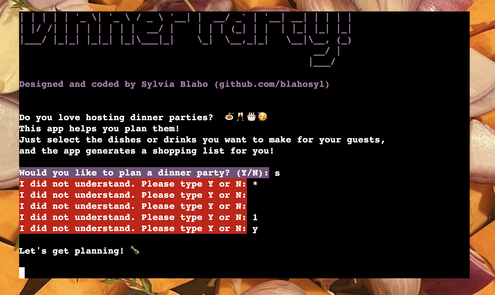
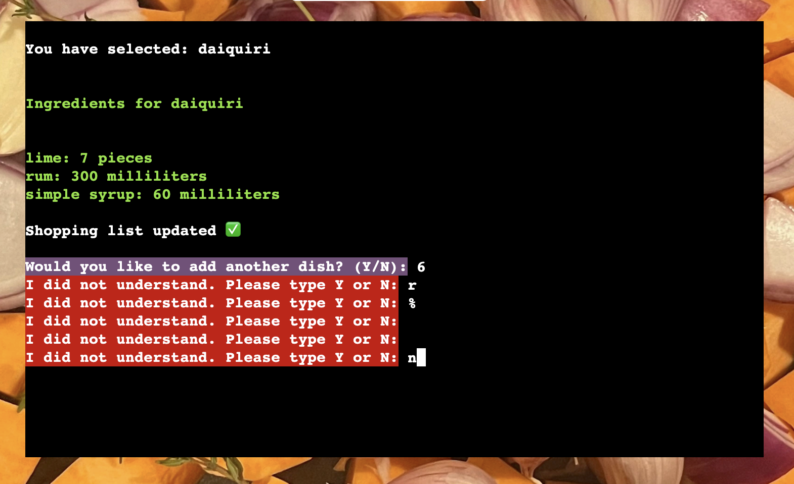
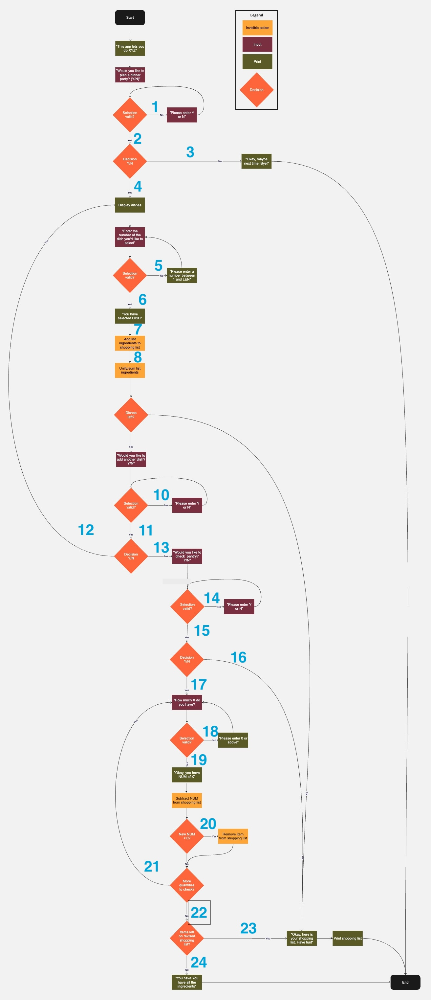

This document describes the testing procedures for the [Dinner Party app](README.md).

## User story testing

## Code validation

### Naming conventions used

- all class names are in `CamelCase`.
- all constant names are in `ALL_CAPS`.
- all variable names are in `snake_case`.
- following my mentor's suggestion, I changed the names of global variables (that are not constants) so that they always start with an underscore: `_global_variable`.

### PIP8 validation

### HTML/CSS validation

## Feature testing

## User input validation

### Y/N questions

3 such questions occur in the program flow:

- [Initial question](#initial-question)
- [Add more dishes question](#add-more-dishes-question)
- [Check pantry question](#check-pantr-question)

#### Initial question

`Would you like to plan a dinner party? (Y/N):`

#### Single-step test cases

|Input						|Expected answer	|Result|
|---						|---				|:---:	|
|other letter character	|I did not understand. Please type Y or N:|✅|
|multiple letter characters|I did not understand. Please type Y or N:|✅|
|special character	|I did not understand. Please type Y or N:|✅|
|multiple special characters	|I did not understand. Please type Y or N:|✅|
|space	|I did not understand. Please type Y or N:|✅|
|multiple spaces	|I did not understand. Please type Y or N:|✅|
|empty string	|I did not understand. Please type Y or N:|✅|
|number character	|I did not understand. Please type Y or N:|✅|
|multiple number characters	|I did not understand. Please type Y or N:|✅|
|`Y` or `y`			|Here is the list of dishes you can choose from.|✅|
|`N` or `n`			|Maybe some other time, then.|✅|

#### Double-step test cases

|Shorthand	| Stands for|
|---			|---		|
|`Y`			|	`Y` or `y`	|
|`N`			|	`N` or `n`	|
|`X`			| Any other character(s)|

|Input				|Expected answer	|Result|
|---				|---				|:---:	|
|`X` then `X`		|I did not understand[...] x2|✅|
|`X` then `Y`		|I did not understand[...] Here is the list of dishes[...]|✅|
|`X` then `N`		|I did not understand[...] Maybe some other time, then.|✅|
|`Y` then `Y`		|*not possible, program continues after 1st input*|✅|
|`Y` then `X`		|*not possible, program continues after 1st input*|✅|
|`Y` then `N`		|*not possible, program continues after 1st input*|✅|
|`N` then `N`		|*not possible, program continues after 1st input*|✅|
|`N` then `X`		|*not possible, program continues after 1st input*|✅|
|`N` then `Y`		|*not possible, program continues after 1st input*|✅|

#### Add more dishes question

`Would you like to add another dish? (Y/N):`

#### Single-step test cases

|Input						|Expected answer	|Result|
|---						|---				|:---:	|
|other letter character	|I did not understand. Please type Y or N:|✅|
|multiple letter characters	|I did not understand. Please type Y or N:|✅|
|special character	|I did not understand. Please type Y or N:|✅|
|multiple special characters|I did not understand. Please type Y or N:|✅|
|space	|I did not understand. Please type Y or N:|✅|
|multiple spaces	|I did not understand. Please type Y or N:|✅|
|empty string	|I did not understand. Please type Y or N:|✅|
|number character	|I did not understand. Please type Y or N:|✅|
|multiple number characters|I did not understand. Please type Y or N:|✅|
|`Y` or `y`			|Cool, here is the list of dishes again:|✅|
|`N` or `n`			|Got it! That's all for now, then.|✅|

#### Double-step test cases

|Shorthand	| Stands for|
|---			|---		|
|`Y`			|	`Y` or `y`	|
|`N`			|	`N` or `n`	|
|`X`			| Any other character(s)|

|Input				|Expected answer	|Result|
|---				|---				|:---:	|
|`X` then `X`		|I did not understand[...] x2|✅|
|`X` then `Y`		|I did not understand[...] Cool, here is the list of dishes again:|✅|
|`X` then `N`		|I did not understand[...] Got it! That's all for now, then.|✅|
|`Y` then `Y`		|*not possible, program continues after 1st input*|✅|
|`Y` then `X`		|*not possible, program continues after 1st input*|✅|
|`Y` then `N`		|*not possible, program continues after 1st input*|✅|
|`N` then `N`		|*not possible, program continues after 1st input*|✅|
|`N` then `X`		|*not possible, program continues after 1st input*|✅|
|`N` then `Y`		|*not possible, program continues after 1st input*|✅|

#### Add more dishes question

`Would you like to check your pantry for ingredients (Y/N):`

#### Single-step test cases

|Input						|Expected answer	|Result|
|---						|---				|:---:	|
|other letter character	|I did not understand. Please type Y or N:|✅|
|multiple letter characters	|I did not understand. Please type Y or N:|✅|
|special character	|I did not understand. Please type Y or N:|✅|
|multiple special characters|I did not understand. Please type Y or N:|✅|
|space	|I did not understand. Please type Y or N:|✅|
|multiple spaces	|I did not understand. Please type Y or N:|✅|
|empty string	|I did not understand. Please type Y or N:|✅|
|number character	|I did not understand. Please type Y or N:|✅|
|multiple number characters|I did not understand. Please type Y or N:|✅|
|`Y` or `y`			|Let's check your pantry, then!|✅|
|`N` or `n`			|Got it! That's all for now, then.|✅|

#### Double-step test cases

|Shorthand	| Stands for|
|---			|---		|
|`Y`			|	`Y` or `y`	|
|`N`			|	`N` or `n`	|
|`X`			| Any other character(s)|

|Input				|Expected answer	|Result|
|---				|---				|:---:	|
|`X` then `X`		|I did not understand[...] x2|✅|
|`X` then `Y`		|I did not understand[...] Let's check your pantry, then!|✅|
|`X` then `N`		|I did not understand[...] Got it! That's all for now, then.|✅|
|`Y` then `Y`		|*not possible, program continues after 1st input*|✅|
|`Y` then `X`		|*not possible, program continues after 1st input*|✅|
|`Y` then `N`		|*not possible, program continues after 1st input*|✅|
|`N` then `N`		|*not possible, program continues after 1st input*|✅|
|`N` then `X`		|*not possible, program continues after 1st input*|✅|
|`N` then `Y`		|*not possible, program continues after 1st input*|✅|

### Number from a range

#### Integer from a range (bounded)

`Type in the number of the dish you'd like to add:`

This input method accepts integers between 1 and the length of the list of dishes (this changes dynamically from 14 to 1). Both the lower and the upper bound is accepted.

##### Single-step test cases

|Input						|Expected answer	|Result|
|---						|---				|:---:	|
|letter character	|`<input>` is not a valid number. Please type a whole number between 1 and `<range>`.|✅|
|multiple letter characters|`<input>` is not a valid number. Please type a whole number between 1 and `<range>`.|✅|
|special character	|`<input>` is not a valid number. Please type a whole number between 1 and `<range>`.|✅|
| multiple special characters	|`<input>` is not a valid number. Please type a whole number between 1 and `<range>`.|✅|
|space	|`<input>` is not a valid number. Please type a whole number between 1 and `<range>`.|✅|
| multiple spaces	|`<input>` is not a valid number. Please type a whole number between 1 and `<range>`.|✅|
|empty string	|`<input>` is not a valid number. Please type a whole number between 1 and `<range>`.|✅|
|non-integer number	|`<input>` is not a valid number. Please type a whole number between 1 and `<range>`.|✅|
|integer outside the range	|Number`<input>` out of range. Please type a number between 1 and `<range>`:|✅|
|integer from the specified range	|You have selected: `<dish>`|✅|

##### Double-step test cases

|Shorthand	| Stands for|
|---			|---		|
|`INT`✅	|integer from the range	|
|`INT`❌	|integer from outside the range|
|`X`			| Any other character(s)|

|Input						|Expected answer	|Result|
|---						|---				|:---:
|`X` then `X`				|`<input>` is not a valid number[...] x2|✅|
|`X` then `INT`❌		|`<input>` is not a valid number[...] Number`<input>` out of range[...]|✅|
|`X` then `INT`✅		|`<input>` is not a valid number[...] You have selected[...]|✅|
|`INT`❌ then `INT`❌	|Number`<input>` out of range[...] x2 |✅|
|`INT`❌ then `X`		|Number`<input>` out of range[...] `<input>` is not a valid number[...] |✅|
|`INT`❌ then `INT`✅		|Number`<input>` out of range[...]  You have selected[...]|✅|
|`INT`✅ then `INT`✅		|*not possible, program continues after 1st input*|✅|
|`INT`✅ then `X`		|*not possible, program continues after 1st input*|✅|
|`INT`✅ then `INT`❌		|*not possible, program continues after 1st input*|✅|

#### Float from a range

`How many <units> of <ingredient> do you have?`

This input method accepts floats that are positive, including 0.

##### Single-step test cases

|Input						|Expected answer	|Result|
|---						|---				|:---:|
|letter character	|`<input>` is not a valid number. Please type a number that is 0 or above.|✅|
|multiple letter characters|`<input>` is not a valid number. Please type a whole number between 1 and `<range>`.|✅|
|special character	|`<input>` is not a valid number. Please type a whole number between 1 and `<range>`.|✅|
| multiple special characters	|`<input>` is not a valid number. Please type a whole number between 1 and `<range>`.|✅|
|space	|`<input>` is not a valid number. Please type a whole number between 1 and `<range>`.|✅|
| multiple spaces	|`<input>` is not a valid number. Please type a whole number between 1 and `<range>`.|✅|
|empty string	|`<input>` is not a valid number. Please type a whole number between 1 and `<range>`.|✅|
|non-positive number	|`<input>` is not a valid number. Please type a whole number between 1 and `<range>`.|✅|
|float from the specified range| Got it, you have `<input>` `<units>` of `<ingredient>`||✅|

##### Double-step test cases

|Shorthand	| Stands for|
|---			|---		|
|`INT`✅	|integer from the range	|
|`INT`❌	|integer from outside the range|
|`X`			| Any other character(s)|

|Input						|Expected answer	|Result|
|---						|---				|:---:
|`X` then `X`				|`<input>` is not a valid number[...] x2|✅|
|`X` then `INT`❌		|`<input>` is not a valid number[...] Number`<input>` out of range[...]|✅|
|`X` then `INT`✅		|`<input>` is not a valid number[...] Got it, you have[...]|✅|
|`INT`❌ then `INT`❌	|Number`<input>` out of range[...] x2 |✅|
|`INT`❌ then `X`		|Number`<input>` out of range[...] `<input>` is not a valid number[...] |✅|
|`INT`❌ then `INT`✅		|Number`<input>` out of range[...]  Got it, you have[...]|✅|
|`INT`✅ then `INT`✅		|*not possible, program continues after 1st input*|✅|
|`INT`✅ then `X`		|*not possible, program continues after 1st input*|✅|
|`INT`✅ then `INT`❌		|*not possible, program continues after 1st input*|✅|

## Flow testing

The program flow can be summarised as follows:

- if the user answers `Y` to the initial question: start planning loop
- if the user answers `N` to the 1st question: end with message
- when the user selects a dish:
	- remove it from the list of dishes
	- display its name and ingredients
	- add its ingredients to the shopping list
- if the shopping list already contains an ingredient that is added: combine two items into one, sum the ingredient quantity
- if the user wants to continue adding an ingredient: rerun planning loop
- if the user does not want to  add more ingredients: 
	- end planning loop
	- ask if they want to check their pantry
- if the user selects all dishes: 
	- end planning loop
	- ask if they want to check their pantry
- if the user does not want to check the pantry:
	- print shopping list, end program
- if the user wants to check the pantry
	- ask how much of each shopping list ingredient they have
	- subtract answer from quantity on shopping list
		- if resulting quantity is 0 or less, remove item from the list
- if there are shopping list items left, print shopping list
- end program with message

All events in the flow work as excpected.

On the flowchart below, I marked the crucial places in the flow that have beed manually tested. The table below  the flowchart summarizes the event and the behaviour that is expected to follow it, along with the test results.

All events in the flow work as excpected.

|Nr		|Event|Excpected behaviour	|Result|
|---:	|---|	---					|:---:|	
|1		|Input not valid| Error message, new input|✅|
|2		|Input valid| Proceed|✅|
|3		|Input `N`| End program with message|✅|
|4		|Input `Y`| Display dishes, start planning loop|✅|
|5		|Input `N`ot valid| Error message, new input|✅|
|6		|Input valid| Confirm selection|✅|
|7		|Input valid| Add ingredients to shopping list|✅|
|8		|Ingredients added to shopping list| Unify quantities in shopping list|✅|
|9		|No dishes left	|Ask to check pantry|✅|
|10		|Input `N`ot valid| Error message, new input|✅|
|11		|Input valid| Proceed|✅|
|12		|Input `Y`| Display dishes, repeat planning loop|✅|
|13		|Input `N`| Ask to check pantry |✅|
|14		|Input `N`ot valid| Error message, new input|✅|
|15		|Input valid| Proceed|✅|
|16		|Input `N`| Print shopping list, End program with message|✅|
|17		|Input `Y`| Start pantry loop, ask quantity of ingredient|✅|
|18		|Input not valid| Error message, new input|✅|
|19		|Input valid| Comfirm message, subtract `number` from shopping list|✅|
|20		|`number < 0`| remove item from shopping list|✅|
|21		|There are more quantities to check| repeat pantry loop|✅|
|22		|There are no more quantities to check| proceed|✅|
|23		|There are items left on shopping list| Print shopping list, End program with message|✅|
|24		|There are no items left on shopping list| End program with message|✅|

### Database data validation

The database in Google Sheets was manually checked for the following:

|Check											|Result|
|---											|:---:|
| dishes are in the 2nd row|✅|
| ingredients are in the 1st column|✅|
| capitalization (none)|✅|
| spelling|✅|
| quantity cells only contain floats|✅|
| each ingredient cell contains `(` and `)`|✅|

#### Devices & browsers

##### Devices

The website was tested on the following devices:

 - Macbook Air M2, Mac OS Sonoma 14.3.1 
 - Macbook Air M1, Mac OS Sonoma 14.3.1

 ##### Browsers

The site was tested on the following browsers:

- Google Chrome
- Microsoft Edge 

## Bugs

All bugs are tracked in [GitHub Issues](https://github.com/blahosyl/dinner-party/issues).

#### Known bugs

There are no known bugs in the project.

#### Solved bugs

Solved bugs are listed in [GitHub Issues](https://github.com/blahosyl/dinner-party/issues?q=is%3Aissue+label%3Abug).

